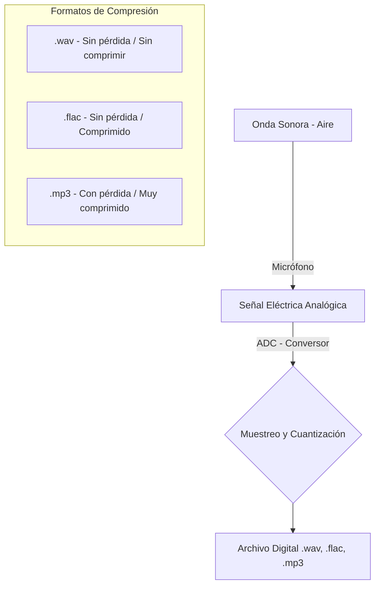
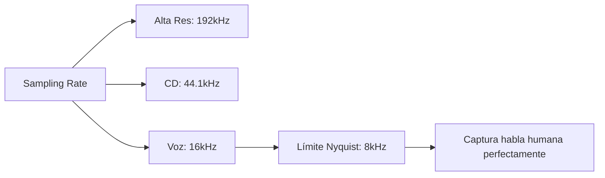
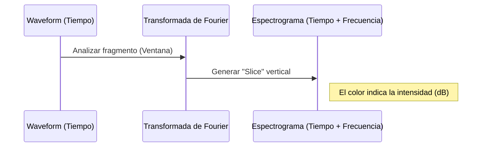
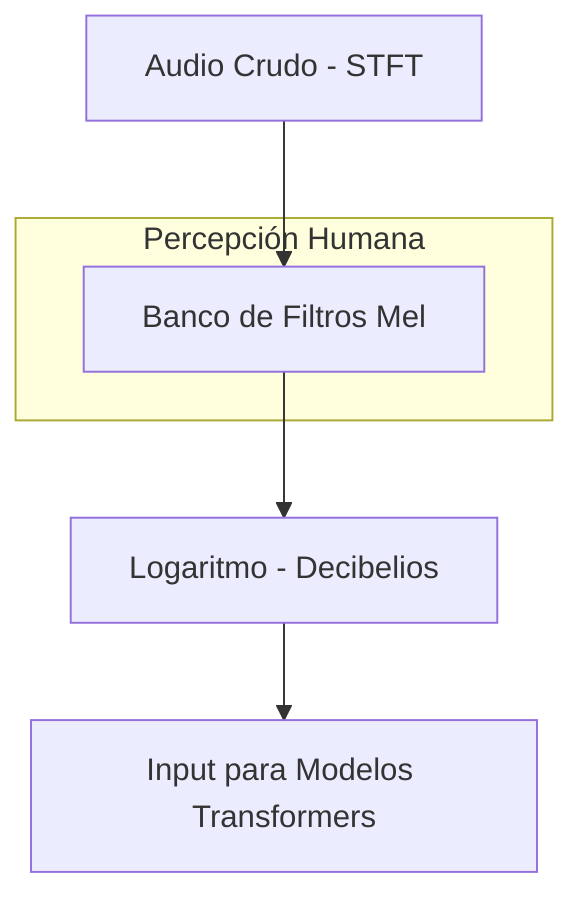

# Análisis y Representación de Datos de Audio

El sonido es, por naturaleza, una onda continua que contiene un número infinito de valores en un tiempo dado. Para que los dispositivos digitales (que esperan arreglos finitos) puedan procesar, almacenar y transmitir sonido, es necesario convertirlo en una **representación digital**.

---

## 1. El Proceso de Digitalización

La señal acústica es capturada y transformada siguiendo este flujo técnico:



---

## 2. Muestreo y Frecuencia de Muestreo (Sampling Rate)

El muestero es el proceso de medir el valor de una señal continua en pasos de tiempo fijos.

### Conceptos Clave
*   **Señal Discreta:** Contiene un número finito de valores en intervalos uniformes.
*   **Frecuencia de Muestreo (Hz):** Número de muestras tomadas en un segundo.
*   **Límite de Nyquist:** La frecuencia más alta que se puede capturar es exactamente **la mitad** de la frecuencia de muestreo.

### Comparativa de Frecuencias
| Aplicación          | Frecuencia (Hz)    | Notas                                                             |
| :------------------ | :----------------- | :---------------------------------------------------------------- |
| **Voz Humana**      | 16,000 Hz (16 kHz) | Suficiente para capturar frecuencias audibles de habla (< 8 kHz). |
| **Calidad CD**      | 44,100 Hz          | Estándar de la industria musical.                                 |
| **Alta Resolución** | 192,000 Hz         | Para audiófilos y producción profesional.                         |

> [!IMPORTANT]
> Si el muestreo es demasiado bajo (ej. 8 kHz), la voz sonará opaca o amortiguada porque no se capturan las frecuencias altas.



---

## 3. Amplitud y Profundidad de Bits (Bit Depth)

Mientras la frecuencia de muestreo define el "tiempo", la profundidad de bits define la "precisión" de cada muestra.

### Amplitud
*   Es la presión sonora en un instante dado.
*   Se percibe como **Loudness (Volumen)**.
*   Se mide en **Decibelios (dB)** (escala logarítmica).

### Profundidad de Bits
Determina cuántos niveles de intensidad (pasos) se pueden registrar:
*   **16-bit:** 65,536 pasos.
*   **24-bit:** 16,777,216 pasos.
*   **32-bit (Float):** Utiliza números de punto flotante entre `[-1.0, 1.0]`. Es el formato estándar para modelos de Machine Learning.
---


## 4. Visualización: Del Tiempo a la Frecuencia

Existen tres formas principales de visualizar y procesar el audio:

### A. Forma de Onda (Waveform) - Dominio del Tiempo
Muestra cómo cambia la amplitud a lo largo del tiempo.
*   **Utilidad:** Identificar eventos sonoros, ruido y volumen general.
*   **Rango:** Típicamente normalizado entre `[-1.0, 1.0]`.

### B. Espectro de Frecuencia - Dominio de la Frecuencia
Muestra qué frecuencias componen un fragmento de sonido mediante la **Transformada de Fourier (FFT)**.
*   **Eje X:** Frecuencia (Hz).
*   **Eje Y:** Intensidad (dB).

### C. Espectrograma
Combina ambos mundos: muestra cómo cambian las frecuencias a través del tiempo.



---

## 5. El Mel Espectrograma

Es la representación más utilizada en **Procesamiento de Lenguaje Natural (PLN)** y **Reconocimiento de Voz**.

*   **Escala Mel:** Escala perceptual que imita el oído humano (somos más sensibles a cambios en frecuencias bajas que en altas).
*   **Log-Mel Spectrogram:** Aplica una transformación logarítmica a las intensidades para que el modelo aprenda mejor.



> [!TIP]
> Dado que los modelos Transformers tratan el audio como secuencias, es **crítico** que todos los archivos en un dataset tengan la misma frecuencia de muestero (Resampling).


```python
import librosa

# Cargar un archivo de ejemplo (trompeta)
array, sampling_rate = librosa.load(librosa.ex("trumpet"))
```

La salida de la FFT es una matriz de números complejos. Usamos `np.abs(dft)` para extraer la **amplitud** (magnitud) y descartamos la fase, que suele ser menos relevante en modelos de ML. Al usar `librosa.amplitude_to_db()`, facilitamos la visualización de detalles finos en una escala logarítmica.

### Espectrograma (STFT)

Para ver cómo cambian las frecuencias con el tiempo, tomamos múltiples DFT en ventanas pequeñas y las apilamos. Este proceso se llama **STFT** (Transformada de Fourier de Tiempo Corto).

```python
# Calcular la STFT
D = librosa.stft(array)
S_db = librosa.amplitude_to_db(np.abs(D), ref=np.max)

# Visualizar el espectrograma
plt.figure().set_figwidth(12)
librosa.display.specshow(S_db, x_axis="time", y_axis="hz")
plt.colorbar(format="%+2.0f dB")
plt.title("Espectrograma (STFT)")
```

### Espectrograma Mel

El oído humano no percibe las frecuencias de forma lineal. Somos más sensibles a cambios en frecuencias bajas. La **Escala Mel** recrea esta sensibilidad logarítmica.

```python
# Calcular el Mel Spectrogram
S = librosa.feature.melspectrogram(y=array, sr=sampling_rate, n_mels=128, fmax=8000)
S_dB = librosa.power_to_db(S, ref=np.max)

# Visualizar
plt.figure().set_figwidth(12)
librosa.display.specshow(S_dB, x_axis="time", y_axis="mel", sr=sampling_rate, fmax=8000)
plt.colorbar(format="%+2.0f dB")
plt.title("Log-Mel Spectrogram")
```

*   **n_mels:** Número de bandas de frecuencia (comúnmente 40, 80 o 128).
*   **fmax:** Frecuencia máxima de interés.
*   **Información:** El espectrograma Mel es la entrada estándar para la mayoría de los modelos de audio modernos (como Whisper o Wav2Vec2).
