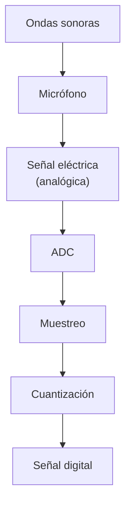
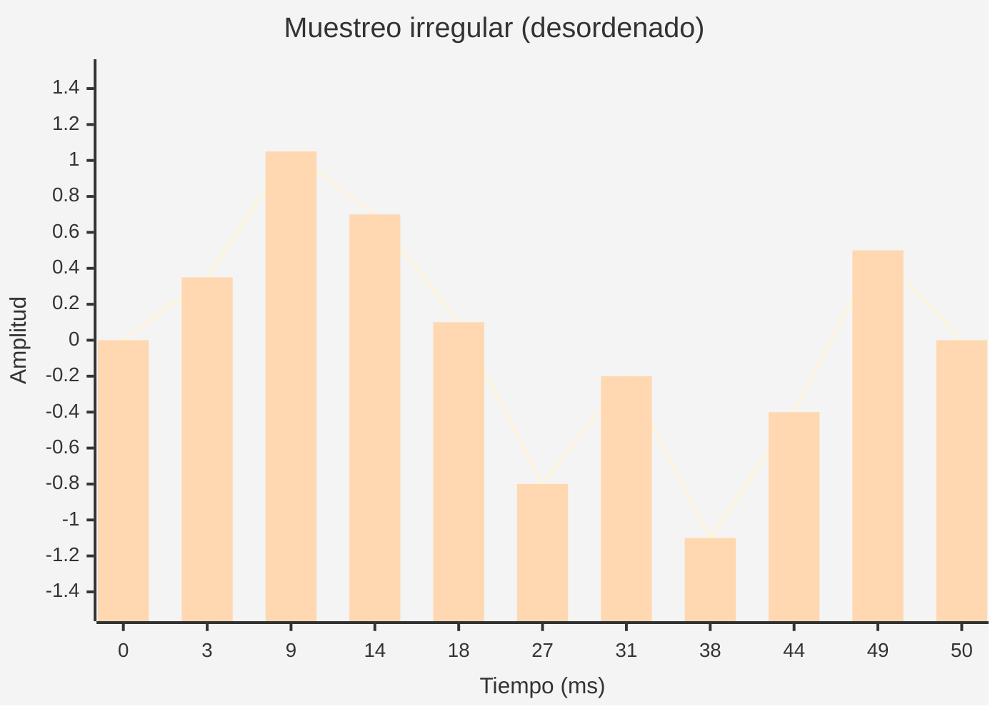
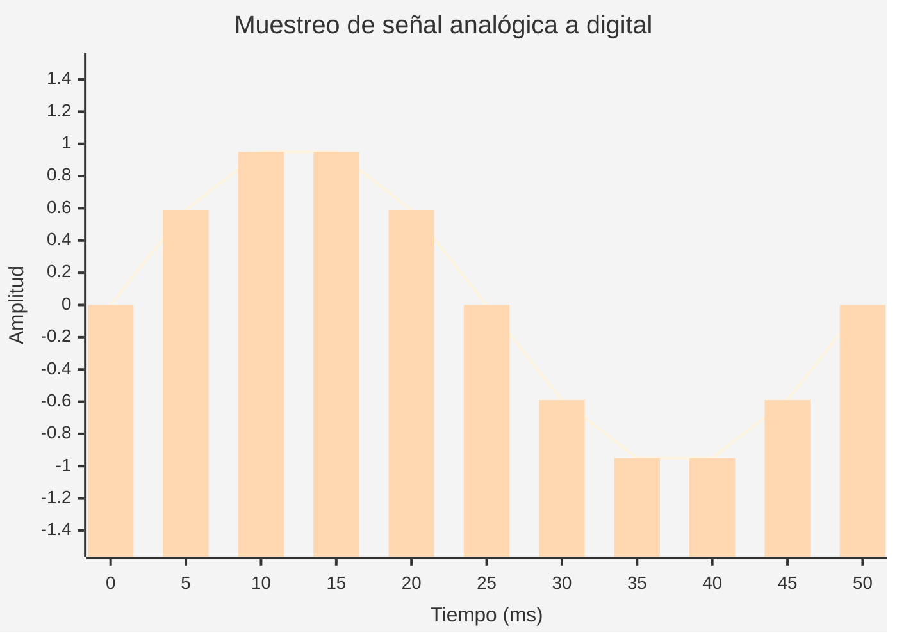
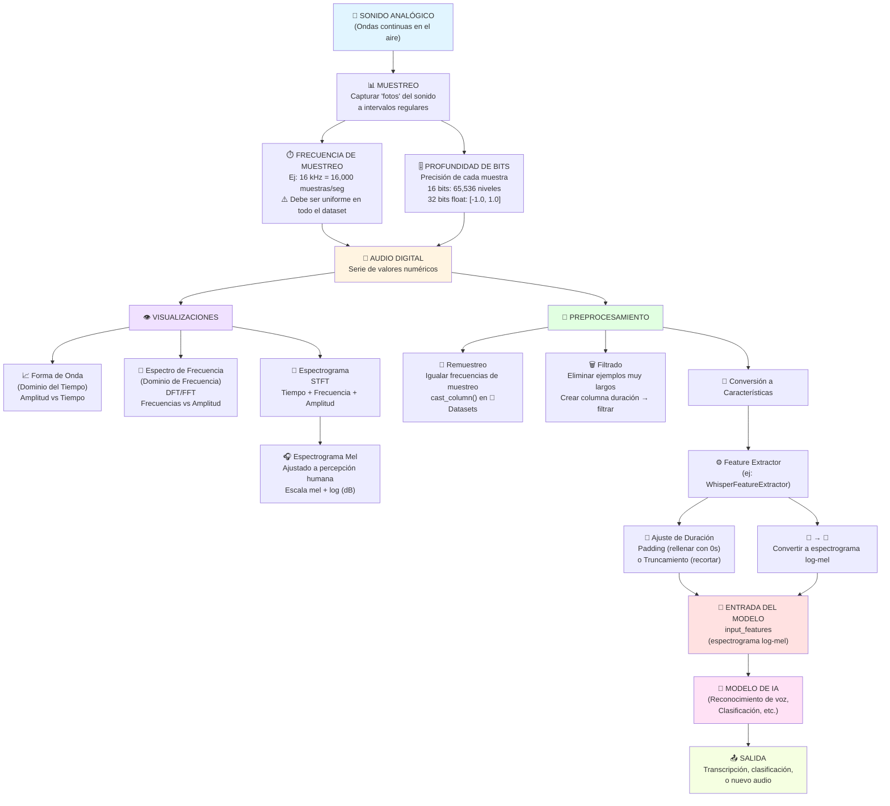

# Llm_audio

`.wav` (Archivo de audio de forma de onda), `.flac` (Códec de audio gratuito sin pérdidas) y `.mp3` (Capa de audio MPEG-1 3). Cada uno comprime de manera diferente cada archivo

## WAV (Archivo de audio de forma de onda)

**¿Qué es?** Es un formato de audio sin comprimir que almacena datos de audio en su forma original, sin pérdida de calidad.

**¿Cuándo se usa?** Se utiliza principalmente en producción musical profesional, grabación de estudio, masterización y cuando se requiere la máxima calidad de audio.

**Ventajas:**

- Calidad de audio máxima sin pérdida de información
- Compatible con prácticamente todos los programas de edición de audio
- Ideal para procesamiento y edición posterior
- No hay degradación por compresión

**Desventajas:**

- Archivos muy grandes (aproximadamente 10 MB por minuto de audio estéreo)
- Consume mucho espacio de almacenamiento
- No es práctico para streaming o compartir por internet

## FLAC (Códec de audio gratuito sin pérdidas)

**¿Qué es?** Es un formato de audio comprimido sin pérdidas, lo que significa que reduce el tamaño del archivo sin sacrificar calidad.

**¿Cuándo se usa?** Se usa para archivar música de alta calidad, audiófilos que desean calidad superior sin ocupar tanto espacio como WAV, y para distribución de audio de alta fidelidad.

**Ventajas:**

- Compresión sin pérdida de calidad (reduce archivos entre 30-50%)
- Mantiene toda la información del audio original
- Código abierto y gratuito
- Soporta metadatos completos

**Desventajas:**

- Archivos aún relativamente grandes comparados con MP3
- No todos los dispositivos lo soportan nativamente
- Requiere más procesamiento para reproducción

## MP3 (Capa de audio MPEG-1 3)

**¿Qué es?** Es un formato de audio comprimido con pérdida que reduce significativamente el tamaño del archivo eliminando información que el oído humano típicamente no percibe.

**¿Cuándo se usa?** Se utiliza para música en dispositivos portátiles, streaming, podcasts, distribución en línea, y cuando el espacio de almacenamiento es limitado.

**Ventajas:**

- Archivos muy pequeños (aproximadamente 1 MB por minuto con calidad estándar)
- Compatible con prácticamente todos los dispositivos y plataformas
- Excelente para compartir y transmitir por internet
- Balance razonable entre calidad y tamaño de archivo

**Desventajas:**

- Pérdida de calidad de audio (compresión con pérdida)
- No recomendado para producción profesional o edición
- La calidad se degrada con cada re-codificación
- No es ideal para audiófilos o sistemas de audio de alta gama

## Del sonido analógico al audio digital

El proceso de conversión de una señal de audio continua (analógica) a una representación digital implica varios pasos fundamentales:

### Explicación

- **Ondas sonoras:** Sonido continuo en el aire.
- **Micrófono:** Convierte el sonido en señal eléctrica.
- **Señal eléctrica (analógica):** Voltaje continuo que representa el sonido.
- **ADC:** Convierte la señal analógica en datos.
- **Muestreo:** Toma “fotos” de la señal a intervalos regulares.
- **Cuantización:** Asigna un número a cada muestra.
- **Señal digital:** Secuencia de valores lista para guardarse o procesarse.

### Ejemplo visual del muestreo

Para ver el efecto, primero muestro un muestreo **“desordenado”** (intervalos irregulares y valores no consistentes), y luego el muestreo **regular**.

**1) Muestreo “desordenado” (irregular)**

**2) Muestreo regular (uniforme)**

A continuación se muestra cómo una señal continua (analógica) se convierte en una señal discreta (digital) mediante el muestreo:

**Interpretación de la gráfica:**

- La **línea continua** representa la señal analógica original (sonido real como una onda suave)
- Las **barras verticales** representan las muestras discretas tomadas a intervalos regulares de tiempo
- Cada barra captura el valor de amplitud en ese momento específico
- Entre más muestras por segundo (mayor frecuencia de muestreo), más precisa es la representación digital
- Con suficientes muestras, la señal digital puede reconstruir fielmente la señal analógica original

## Frecuencia de muestreo

**¿Qué es?** Es el número de muestras tomadas por segundo al digitalizar audio, medida en hercios (Hz).

**Ejemplos comunes:**

- **Audio de calidad CD:** 44.100 Hz (44,1 kHz) - 44.100 muestras por segundo
- **Audio de alta resolución:** 192.000 Hz (192 kHz)
- **Modelos de habla/IA:** 16.000 Hz (16 kHz)

**Principio:** A mayor frecuencia de muestreo, mayor fidelidad en la reproducción del sonido original, pero también mayor tamaño de archivo.

## Resumen: Del sonido analógico al digital

El audio digital se crea capturando muestras de una señal analógica a intervalos regulares. Este proceso se llama **muestreo**, y la **frecuencia de muestreo** determina cuántas veces por segundo se toma una "foto" del sonido.

## El límite de Nyquist

**¿Qué es?** El teorema de Nyquist-Shannon establece que para capturar correctamente una señal, la frecuencia de muestreo debe ser al menos el doble de la frecuencia más alta que queremos grabar.

**Fórmula:**

`Frecuencia máxima capturable = Frecuencia de muestreo ÷ 2`

**Ejemplos prácticos:**

- **Habla humana (16 kHz):** Captura hasta 8 kHz, suficiente para todas las frecuencias audibles del habla
- **Audio CD (44,1 kHz):** Captura hasta 22,05 kHz, cubriendo todo el rango auditivo humano (20 Hz - 20 kHz)
- **Audio profesional (96 kHz):** Captura hasta 48 kHz, más allá de la audición humana pero útil para procesamiento

### ¿Por qué 16 kHz es suficiente para habla?

Las frecuencias importantes del habla humana están por debajo de 8 kHz:

- Vocales: 300 Hz - 3 kHz
- Consonantes: 2 kHz - 8 kHz
- Con 16 kHz de muestreo, se captura todo hasta 8 kHz (límite de Nyquist)

### ¿Qué pasa si muestreamos muy bajo?

**Submuestreo (undersampling):** Si la frecuencia de muestreo es demasiado baja, ocurre **aliasing**:

- Se pierden frecuencias altas
- El audio suena "amortiguado" o "apagado"
- Ejemplo: habla a 8 kHz suena sin claridad porque solo captura hasta 4 kHz

### ¿Qué pasa si muestreamos muy alto?

**Sobremuestreo (oversampling):**

- No se captura información adicional útil (nada que el oído humano pueda percibir)
- Archivos más grandes innecesariamente
- Mayor costo computacional sin beneficio audible

### Tabla de referencia

| **Frecuencia de muestreo** | **Límite de Nyquist** | **Uso recomendado** |
| --- | --- | --- |
| 8 kHz | 4 kHz | Telefonía (baja calidad) |
| 16 kHz | 8 kHz | Modelos de habla/IA, reconocimiento de voz |
| 44,1 kHz | 22,05 kHz | Audio CD, música estándar |
| 48 kHz | 24 kHz | Video profesional |
| 96 kHz | 48 kHz | Producción musical profesional |
| 192 kHz | 96 kHz | Masterización de audio de alta resolución |

**Conclusión:** La frecuencia de muestreo debe elegirse según el contenido: 16 kHz es óptimo para habla porque captura todas las frecuencias necesarias sin desperdiciar recursos computacionales.

## Resumen: Importancia de la Frecuencia de Muestreo y Preprocesamiento de Audio

### 1. Frecuencia de Muestreo Uniforme

**Concepto clave:** Todos los archivos de audio en tu conjunto de datos deben tener la misma frecuencia de muestreo.

**¿Por qué?** Un audio de 5 segundos a 16 kHz genera 80,000 valores, mientras que a 8 kHz genera solo 40,000 valores. Los modelos de IA no pueden generalizar bien entre diferentes frecuencias de muestreo porque tratan los datos como secuencias de diferente longitud.

**Solución:** El **remuestreo** ajusta la frecuencia de muestreo para que todos los archivos coincidan.

### 2. Amplitud y Profundidad de Bits

**Amplitud:** Mide qué tan fuerte es un sonido en un momento dado (en decibeles). Ejemplo: voz normal ≈ 60 dB, concierto de rock ≈ 125 dB.

**Profundidad de bits:** Determina cuán precisamente se captura la amplitud:

- **16 bits:** 65,536 niveles de precisión (suficiente para la mayoría de aplicaciones)
- **24 bits:** 16,777,216 niveles (calidad profesional)
- **32 bits (punto flotante):** Valores entre -1.0 y 1.0, ideal para aprendizaje automático

**Nota sobre decibeles en audio digital:** 0 dB es el máximo volumen posible, todo lo demás es negativo. Cada -6 dB reduce la amplitud a la mitad.

### 3. Visualizaciones de Audio

### a) Forma de Onda (Dominio del Tiempo)

Muestra cómo cambia la amplitud del sonido a lo largo del tiempo. Útil para ver el volumen general, detectar ruido y verificar que el preprocesamiento funcionó correctamente.

### b) Espectro de Frecuencia (Dominio de Frecuencia)

Muestra qué frecuencias (tonos) están presentes en un momento específico y qué tan fuertes son. Se calcula usando la Transformada Discreta de Fourier (DFT o FFT).

### c) Espectrograma

Combina tiempo y frecuencia en un solo gráfico. Muestra cómo cambian las frecuencias a lo largo del tiempo usando colores para indicar la intensidad. Se crea tomando múltiples DFTs de segmentos cortos del audio (usando STFT - Transformada de Fourier de Tiempo Corto).

### d) Espectrograma Mel

Similar al espectrograma pero ajustado a cómo los humanos percibimos el sonido. Usa la "escala mel" que refleja que nuestros oídos son más sensibles a cambios en frecuencias bajas que altas.

**Parámetros importantes:**

- `n_mels`: Número de bandas de frecuencia (común: 40-80)
- `fmax`: Frecuencia máxima a considerar

**Espectrograma log-mel:** Cuando las intensidades se expresan en decibeles (escala logarítmica).

### 4. Preprocesamiento para Modelos de IA

Los modelos de aprendizaje automático no pueden trabajar directamente con audio crudo. Necesitan que el audio se convierta en **características de entrada**.

### Ejemplo: Whisper (modelo de reconocimiento de voz)

**Paso 1:** Ajustar duración - Todos los ejemplos se ajustan a 30 segundos (rellena con ceros los cortos, recorta los largos).

**Paso 2:** Convertir a espectrograma log-mel - Transforma el audio en una representación visual que el modelo puede procesar.

### Herramientas en 🤗 Transformers

- **Feature Extractor:** Convierte audio crudo en características que el modelo entiende
- **Tokenizer:** Procesa texto (para tareas multimodales como reconocimiento de voz)
- **Processor:** Combina ambos en una sola herramienta

### 5. Pasos Prácticos de Preprocesamiento

1. **Remuestreo:** Usar `cast_column` de 🤗Datasets para ajustar la frecuencia de muestreo
2. **Filtrado:** Eliminar ejemplos muy largos (por ejemplo, >20 segundos) para evitar problemas de memoria
3. **Conversión a características:** Aplicar el feature extractor del modelo para transformar audio en el formato esperado

## Mapa Conceptual: Del Sonido Analógico al Modelo de IA

### Puntos Clave del Mapa Conceptual

- **Azul claro:** Sonido analógico original
- **Amarillo:** Audio digital (después del muestreo)
- **Morado:** Diferentes formas de visualizar el audio
- **Verde:** Pasos de preprocesamiento necesarios
- **Rojo:** Datos listos para el modelo de IA
- **Rosa:** Modelo de aprendizaje automático
- **Verde lima:** Resultado final

**Conclusión:** El audio pasa por múltiples transformaciones desde el sonido 
real hasta los datos que un modelo de IA puede procesar. Cada paso es crucial: frecuencia de muestreo uniforme, conversión a características adecuadas (como espectrogramas mel), y preprocesamiento correcto. Las herramientas de 🤗 Transformers y 🤗 Datasets automatizan gran parte de este proceso.

