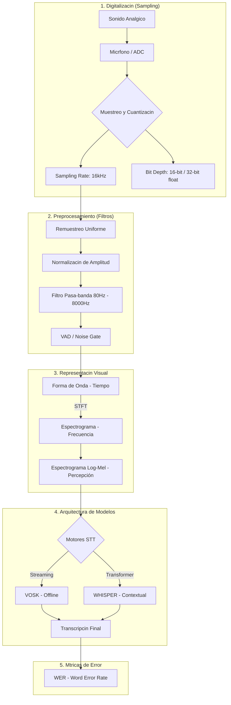

# INFORME TCNICO: Fundamentos de Procesamiento de Audio y Modelos STT

Este documento consolida los conceptos fundamentales de la digitalizacin de audio y el preprocesamiento necesario para modelos de reconocimiento de voz (**Speech-to-Text**).

---

## 🗺️ Mapa Mental: Del Sonido Analgico al Modelo de IA

El siguiente diagrama resume el flujo tcnico de transformacin de la seal sonora:

---

## 📊 Comparativa de Tecnologas STT

Segn el análisis tecnolgico de los modelos Whisper y Vosk:

| Caracterstica | **Whisper (OpenAI)** | **Vosk (Kaldi-based)** |
| :--- | :--- | :--- |
| **Entrada Principal** | Espectrograma de Log-Mel. | Caractersticas MFCC. |
| **Tasa de Muestreo** | 16,000 Hz (fija). | Flexible (8k / 16k). |
| **Punto Fuerte** | Resistente a ruidos de fondo. | Extremadamente rpido y 100% offline. |
| **Punto Dbil** | Alucinaciones en silencios/ecos. | Muy sensible al ruido. |
| **Mecnica** | Procesa bloques de 30 seg. | Procesa en tiempo real (streaming). |

---

## 🧠 Conceptos Tcnicos Crticos

### 1. El Lmite de Nyquist
Para capturar voz humana de forma clara, la frecuencia de muestreo debe ser al menos el doble de la frecuencia mxima deseada ($f_s \div 2$). **16kHz** es el estndar ya que captura hasta 8kHz, cubriendo todo el rango del habla humana.

### 2. El Espectrograma Mel
Es una escala perceptual que imita el odo humano, siendo ms sensible a cambios en frecuencias bajas que en altas. Los modelos modernos (como Transformers) utilizan el **Log-Mel Spectrogram** para procesar el audio como si fuera una imagen o secuencia.

### 3. El "Módulo de Audio Perfecto"
Para maximizar el rendimiento de la IA, el audio debe pasar por este pipeline:
1.  **Conversin a Mono:** Evita problemas de fase del estreo.
2.  **Noise Gate:** Elimina el ruido en silencios.
3.  **VAD (Voice Activity Detection):** Procesa solo donde hay habla real.
4.  **Normalizacin:** Evita el *clipping* (distorsin) y asegura un volumen constante.

### 4. Causas de Error (Fallo en la IA)
*   **Aliasing:** Seales falsas por bajo muestreo.
*   **Reverberacin (Eco):** Confunde el contexto del modelo.
*   **Compresin Extrema:** El uso de formatos con prdida (MP3 de bajo bitrate) destruye frecuencias tiles.
