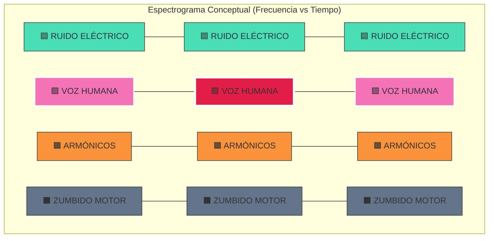

### 1. El Fenómeno del "Aliasing" y la Tasa de Muestreo ($f_s$)
Si el audio original se grabó a una tasa muy baja (por ejemplo, 8kHz como en telefonía antigua), se pierde información de alta frecuencia necesaria para distinguir consonantes fricativas ($s, f, sh$).
* **Teoría:** Según el **Teorema de Nyquist-Shannon**, para reconstruir una señal debes muestrear al doble de la frecuencia máxima deseada.
* **Problema:** Si el audio tiene componentes de alta frecuencia no filtrados antes de la digitalización, se produce "aliasing" (falsas frecuencias), lo que confunde los pesos neuronales de Whisper.
* **Módulo ideal:** Un **Resampler** de alta calidad que normalice todo a 16kHz (el estándar de ambos modelos) usando interpolación de Sinc para evitar artefactos.

### 2. Amplitud y Normalización (Rango Dinámico)
Si el audio está muy bajo, el "piso de ruido" ($noise floor$) se acerca a la voz. Si está muy alto, la onda se "recorta" (**clipping**), achatando las crestas de la señal y destruyendo la información.
* **Efecto en la IA:** El clipping convierte una onda sinusoidal suave en algo parecido a una onda cuadrada, lo que genera armónicos falsos que el modelo interpreta como ruido o sonidos extraños.
* **Módulo ideal:** Un **Compresor/Limitador** y una **Normalización EBU R128**. Esto asegura que el volumen sea constante sin llegar a distorsionar.

### 3. El Espectrograma y la Transformada de Fourier ($STFT$)
Whisper no "escucha" el audio como nosotros; lo convierte en un **Espectrograma de Mel**. Si el audio tiene un ruido de fondo en una frecuencia específica (un zumbido de motor a 60Hz, por ejemplo), ese ruido "mancha" el espectrograma.
* **Vosk vs Whisper:** Vosk usa modelos acústicos más rígidos; si una frecuencia está tapada, falla. Whisper es más contextual, pero si el ruido es "no estacionario" (gente hablando de fondo), pierde el hilo.

### 4. Comparativa: ¿Qué necesita cada modelo?

| Requisito | **Whisper (OpenAI)** | **Vosk (Kaldi-based)** |
| :--- | :--- | :--- |
| **Tasa de Muestreo** | 16,000 Hz fija (remuestrea internamente). | Flexible (8k o 16k según el modelo cargado). |
| **Entrada Principal** | **Espectrograma de Log-Mel** (80-128 bandas). | Características acústicas (**MFCC**). |
| **Fortaleza** | Muy resistente a ruidos de fondo constantes. | Extremadamente rápido y funciona 100% offline. |
| **Debilidad** | Tiende a "alucinar" en silencios o ecos. | Muy sensible al ruido; falla si la voz no es clara. |
| **Procesamiento** | Divide el audio en bloques de 30 segundos. | Procesa en tiempo real (streaming). |

---

* **Módulo ideal:** Un filtro **Pass-band** (Pasa-banda) que elimine todo lo que esté por debajo de 80Hz (ruido de vibración) y por encima de 8000Hz (ruido eléctrico innecesario).

---

### ¿Por qué falló ese audio específico?
Probablemente por una de estas tres razones "físicas":
1.  **Reverberación (Eco):** Las colas de las ondas se enciman. Whisper intenta darle sentido y termina inventando palabras (alucinación).
2.  **Fase invertida / Cancelación:** Si se grabó con dos micros y se mezcló mal, ciertas frecuencias de la voz se anulan entre sí, dejando una voz "hueca".
3.  **Códec de compresión:** Si era un MP3 muy comprimido, se eliminan las frecuencias sutiles que Whisper usa para el contexto.

### Propuesta para tu "Módulo de Audio Perfecto"
Si quieres que ambos rindan al 100%, tu script de Python debería pasar el audio por este pipeline antes de enviarlo a la transcripción:

1.  **Conversión a Mono:** El estéreo no sirve para ASR y puede causar problemas de fase.
2.  **Noise Gate:** Silencia los espacios donde no hay voz para que el modelo no intente "traducir" el silencio.
3.  **VAD (Voice Activity Detection):** Usa una herramienta como `webrtcvad` para enviar solo los fragmentos que realmente contienen habla.
4.  **Normalización de Ganancia:** Llevar el pico a -1dB.

---

## 🎨 Visualización Conceptual (Espectrograma)

Esta es una representación visual simplificada de cómo la IA "ve" las frecuencias de un audio (el color indica la intensidad):

---

## 📖 Explicación por Partes (Resumen)

### 1. El Punto de Partida: ¿Por qué falla la IA?
El documento analiza por qué Whisper o Vosk pueden fallar. Generalmente no es por falta de "inteligencia", sino por la **calidad de la señal**. El **WER (Word Error Rate)** mide qué tanto se aleja la transcripción de la realidad.

### 2. Pilar I: Tasa de Muestreo y Aliasing ($f_s$)
*   **Concepto:** La resolución del audio.
*   **Regla:** Según Nyquist-Shannon, debemos muestrear al doble de la frecuencia deseada.
*   **Acción:** Estandarizar a **16kHz** para capturar las consonantes críticas sin generar "fantasmas" sonoros (aliasing).

### 3. Pilar II: Amplitud y Normalización (Volumen)
*   **Problema:** Si el audio es muy bajo, se mezcla con el ruido; si es muy alto, se recorta (**clipping**).
*   **Acción:** Normalizar el volumen (estándar EBU R128) para que la IA reciba una señal limpia y constante.

### 4. Pilar III: El Espectrograma y STFT (Frecuencia)
*   **Mecánica:** La IA "ve" mapas de calor (espectrogramas). El ruido de fondo ensucia ese mapa.
*   **Acción:** Usar un filtro **Pasa-banda (80Hz - 8000Hz)** para dejar solo la voz humana y eliminar zumbidos o ruidos eléctricos.

### 5. Diagnóstico: Causas Físicas del Error
Rendimiento pobre debido a:
*   **Reverberación:** El eco confunde el contexto de la IA.
*   **Cancelación de Fase:** Problemas en la mezcla que anulan la voz.
*   **Compresión extrema:** Pérdida de datos por formatos como MP3 de baja calidad.

### 6. La Receta: El "Módulo de Audio Perfecto"
La secuencia lógica sugerida:
1.  **Mono:** Un solo canal para evitar conflictos.
2.  **Noise Gate:** Limpiar silencios con ruido.
3.  **VAD:** Procesar solo donde hay habla real.
4.  **Ganancia:** Ajustar el volumen final a un nivel óptimo.

