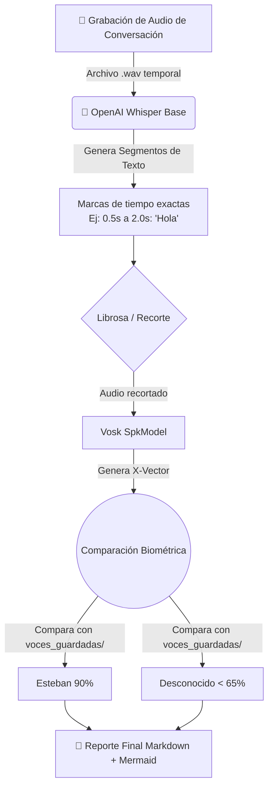

# 🎙️ Whisper + Vosk: Arquitectura de Diarización Biométrica Ligera

## 1. ¿Qué es y por qué se creó?
Tras analizar la limitación de Vosk para separar voces en conversaciones continuas en vivo, creamos el script `WHISPER_PRUEBA.py`. Esta es una solución ingeniosa de **Diarización Híbrida**.

En lugar de preguntar "cuántas personas hablaron" o agrupar voces a ciegas, este script combina la precisión de tiempos de **OpenAI Whisper** con la biometría matemática (X-Vectors) de **Vosk**.

---

## 2. ⚙️ ¿Cómo funciona? (Diagrama de Arquitectura)

### Paso a paso del código:
1. **Grabación Offline:** El sistema captura todo el entorno hasta que el usuario detiene la grabación.
2. **Segmentación (Whisper):** El modelo transcribe el audio y devuelve el texto estructurado en "segmentos" junto a su marca de tiempo exacta.
3. **Extracción y Biometría:** El script recorta ese milisegundo exacto de audio usando `librosa` y se lo inyecta directamente al `SpkModel` de Vosk para sacar el "X-Vector" (la huella dactilar de la voz).
4. **Identificación:** Busca en la carpeta `voces_guardadas/` la firma que más se le parezca usando la métrica de *distancia coseno*.

---

## 3. 🧠 Profundización: ¿Por qué esta arquitectura es ingeniosa?

Para entender este sistema, podemos pensar en él como un equipo de trabajo con dos especialistas:

### A. Los Roles: El "Escriba" y el "Detective"
*   **Whisper (El Escriba):** Tiene un "oído" gramatical excelente. Su trabajo es escuchar la cinta completa y anotar exactamente **qué** se dijo y en qué **segundo exacto** empezó y terminó cada frase. No le importa quién habla, solo el texto y el tiempo.
*   **Vosk (El Detective):** Tiene un "oído" biométrico. No le importa el significado de las palabras, sino el **timbre** de la voz. Su trabajo es recibir un audio limpio y decir: "Esta huella pertenece a Esteban".

### B. El Proceso de "Recorte Quirúrgico"
El problema de los sistemas convencionales es que si dos personas hablan rápido, las frecuencias se mezclan y la biometría falla. Nuestra solución usa la librería **Librosa** para actuar como un bisturí:
1. Toma el mapa de tiempos de Whisper.
2. Recorta el audio original en pedazos pequeños (segmentos).
3. Envía cada pedazo individual a Vosk.
Esto garantiza que la IA de identificación solo escuche a una persona a la vez, aumentando la precisión drásticamente.

---

## 4. 🔧 Detalle técnico de `WHISPER_PRUEBA.py`

El script hace lo siguiente:
* Carga un archivo de audio completo en `Codigos/audios/temp_conversacion.wav`.
* Usa `librosa.load(..., sr=16000)` para normalizar el audio a **16 kHz** y convertirlo a `float32`, el formato que necesita Whisper.
* Invoca el modelo con `whisper.load_model("base")` y `transcribe(..., language="es", fp16=False)`.
* Recorre `resultado["segments"]`, que contiene el texto y los intervalos de inicio y fin de cada frase.
* Para cada segmento, llama a `obtener_vector_vosk(...)`, que carga solo ese fragmento con `librosa.load(..., offset=inicio, duration=fin-inicio)` y lo convierte en bytes PCM para Vosk.
* Vosk devuelve un vector de voz si detecta el parámetro `"spk"`. Ese vector se compara con los perfiles guardados.
* Si ninguna voz supera el umbral de **0.65** en similitud coseno, el segmento se marca como **Desconocido**.
* Finalmente, genera un reporte Markdown con una gráfica Mermaid y una tabla de tiempos.

### Estructura de archivos usada por el script
* `model/`: modelo de Vosk para reconocimiento de texto.
* `model-spk/vosk-model-spk-0.4/`: modelo de locutor para extraer X-vectors.
* `voces_guardadas/`: perfil biométrico de voces en `.json`.
* `Reportes/`: guarda los informes generados.

---

## 5. 📘 Fundamentos desde `PLN_CURSO`

### A. Por qué 16 kHz es crítico
El procesamiento de audio digital se basa en el Teorema de Nyquist-Shannon. Para capturar la voz humana sin perder información útil, el proyecto usa **16 kHz** como frecuencia de muestreo. Esto permite reconstruir frecuencias de hasta 8 kHz, que son las más importantes para la inteligibilidad del habla.

### B. Whisper usa Log-Mel Spectrograms
Whisper no procesa la forma de onda directamente. Convierte el audio en un **espectrograma de Mel** con escala logarítmica. Eso significa que:
* el audio se analiza en ventanas cortas de tiempo,
* se filtra con un banco de filtros Mel,
* se convierte a decibelios logarítmicos.

Ese espectrograma es precisamente el input que los Transformers de Whisper entienden mejor.

### C. Vosk usa MFCC y X-vectors
Vosk, en cambio, trabaja con características acústicas tradicionales como los **MFCC**. Para la identificación de locutor usa un modelo de tipo **X-vector** que transforma cada segmento en un vector de 128 dimensiones.

*   Whisper responde a **qué se dijo**.
*   Vosk responde a **quién lo dijo**.

---

## 6. 🧮 Cómo se compara la biometría

Los perfiles guardados en la carpeta `voces_guardadas/` son archivos `.json` que contienen:
* `nombre`: nombre de la persona.
* `vector`: un array de 128 valores numéricos.

El código calcula la similitud entre el vector del segmento y cada perfil guardado usando la **Distancia Coseno**. Esto es importante porque la magnitud del vector cambia con el volumen y la intensidad, mientras que el ángulo entre vectores captura mejor la identidad vocal.

*   Si la similitud es mayor a **0.65**, se asigna el nombre registrado.
*   Si es menor, se marca como **Desconocido**.

---

## 7. ⚖️ Ventajas y Desventajas de la Implementación

### ✅ Ventajas
* **Ultra Ligero (Hardware Friendly):** Corre perfectamente en un procesador i3 con 8GB de RAM sin GPU.
* **Soluciona las interrupciones:** Al usar los recortes precisos de Whisper, evita que las huellas vocales de dos personas se mezclen.
* **Memoria Biométrica:** Reconoce a las personas por su nombre (si fueron registradas antes en Vosk), eliminando la necesidad de decirle al sistema cuánta gente está hablando.

### ❌ Desventajas
* **Pérdida del Tiempo Real (Live):** Hay que terminar de grabar para que procese el audio.
* **Segmentos muy cortos:** Si alguien dice un simple "ah", el recorte de audio es tan corto que el `SpkModel` de Vosk podría fallar en extraer un vector confiable, resultando en "Desconocido".
